# Simula Summer Project - Prospects of dimension reduction for cerebrospinal fluid flow in brain simulations

TODO
- Talk about that things is tested with manufactured solutions 
- Explain structure of repo 
- Comment code
- Put comma and dots on equations (where it looks fine on the readme as well)
- Can you do links do data paths?

This repo contains the work done as a summer intern at Simula during a six week period in the summer of 2022. The project was guided by my supervisor [Miroslav Kutcha](https://github.com/MiroK).

## Introduction 

In this project we build a framework for simulating the flow of the cerebrospinal fluid (CSF) in the human brain. The CSF flows, among other regions, on the outside of the brain tissue inside the skull. The CSF enter the brain through small pores in the brain tissue and takes part in the transpoortation of waste matter produced in the brain. Thus the motivation for simulating the CSF flow is to contribute to medical brain research. However, such simulations becomes computational expensive when considering large regions of the brain and hence we want to invistigate the possibility to introduce a simpler model by the use of so-called dimension reduction. That is, instead of considering the CSF-filled space as a 3D sphere shell with thickness we reduce it to a 2D sphere encapsulating the brain tissue. In order for such a simplification to be sucessful we most be able to neglect the dynamics in the reduced dimension without any great impacts on the predicted flow. More precisely we want the pressure to be approximately constant on the cross section of the CSF flow through the radial plane. In addition we should have negligble flow in the normal direction to the main CSF flow. Due to the fact that the CSF-filled space is much longer than it is thick, one can hypothesise that the flow might meet the above criterias rather well, which is the topic for this project.

We are going to simulate the CSF flow using finite elements to solve the partial derivative equations (PDEs). For simplicity we initially take on a 2D problem where we consider a 2D slice of the brain. Thus the corresponding dimension reduction problem is to reduce the 2D slice surface of the CSF-filled space to a 1D line. By decreasing the width of the CSF-filled space, we can study the devolopment of the pressure profile on the cross section of the CSF flow and the normal flow on the interface between the CSF-filled space and the brain tissue, as the surface approaches a line. In figure $(1)$ we see the visualization of a real brain scanning as reference for the system we are going to model.

    
    
     <h5 align="left"> 
    Fig.1 - Real brain scanning as a reference for the model geometry. The blue color indicates the CSF-filled space, the white-brown-ish color the brain tissue and the red parts some of the major blood vessels. The left image shows a full 3D view of the brain tissue surface, while the right image shows a sliced version of it.
    </h5>

As seen in figure $(1)$ the surface of the brain is not smooth. Hence we will introduce a wiggled surface and study the prospects for dimension reduction for different geometric modellings of the surface.

Progamming wise we are going to use [Julia](https://julialang.org) as the main language for this project. We use the [Gridap](https://gridap.github.io/Gridap.jl/stable/) module for the finite element part and [Gmsh](https://gmsh.info) for creating the geometry and the mesh.

## Method & Theory 

### Domain

We are going to model our brain as a composition of two domains: The *Stokes* domain and the *Darcy* domain with names corresponding to the equations that governs the fluid flow in these domains (See figure $(2)$ for reference). In the *Stokes* domain the CSF flows in an unobstructed path on the outside of the brain tissue, where the motion is described as Stokes flow (low Reynolds number). This is the domain that we have described as the CSF-filled region so far. In the *Darcy* domain the fluid flows though the pores of the brain tissue where the fluid motion is described as percolation. For this we use Darcy's law. The dividing line between these domains is what we will refer to as the *interface*.

    
    <h5 align="left"> 
    Fig.2 - Example of 2D brain model using default geometry. The orange region represents the Stokes domain $\Omega_S$ and the green region the Darcy domain $\Omega_D$. The black line dividing the Stokes and the Darcy domain represent the interface $\Gamma$. In addition we have grouped and named the boundaries for later reference. For the Stokes domain we have the outer surface $\Lambda_S$ and the left and right boundaries $\Gamma_S$. For the Darcy domain all boundaries expect the interface is grouped as $\Gamma_D$. 
    </h5>

We practical reasons we define a set of default brain geometry parameters for our 2D brain model. The parameters is shown in the following table where along with parameter test interval for the interface geometry. Notice that we have already used the default geometry to showcase the 2D domains in figure $(2)$.

|  Parameter | Default value | Testing interval 
|---|:---:|:---:|
| Radius of curvature | 50 mm |
| Radial length of slab | 10 mm |
| Outer arc length | 100 mm |
| Width of CSF-filled space | 1.5 mm |
| Interface wiggles | Negative half sine waves|
| Outer surface wiggles | No wiggling |
| Wavelength of interface wiggles | 10 mm | [1,  50] mm|
| Amplitude of interface wiggles | 1 mm | [0.1, 5] mm |

Eventually we also want to extend the study to 3D simulations where we will use the same default values as a starting point.

### Equations 

We denote $u_S, p_S$ as velocity and pressure in the Stokes domain $\Omega_S$ respectively, and $p_D$ as pressure in the Darcy domain $\Omega_D$. $\hat{n}_i$ and $\hat{\tau}_i$ denote the normal and tangential vector components on the interface $\Gamma$ with respect to domain $i$. By convention the normal vector is pointing outwards from the domains. Finally, for a domain $\Omega_i$ we denote the complete set of boundaries as $\partial\Omega_i$. We define the problem by the following equations.

####  <ins> Stokes domain </ins>

$$
\begin{align}
    - \nabla \cdot \sigma(u_S, p_S) &= f_s  &\text{in} \ \Omega_S  \\
    \nabla \cdot u_S &= 0   &\text{in} \ \Omega_S \\
    u_S &= u_{S,0}   &\text{on} \ \Lambda_S \\
    u_S \times \hat{n}\_S &= 0   &\text{on} \ \Gamma_S \\
    p_S &= p\_{S,0}   &\text{on} \ \Gamma_S
\end{align}
$$

where

$$
\begin{align}
   \sigma(u_S, p_S) &= 2\mu \ \varepsilon(u_S) - p_S \mathbb{I} \\
   \varepsilon(u_S) &= \frac{1}{2}(\nabla u_S + \nabla^Tu_S)
\end{align}
$$

#### <ins> Darcy domain </ins>

$$
\begin{align}
    \nabla \cdot (-\frac{\kappa}{\mu}\nabla p_D) &= f_D  &\text{in} \ \Omega_D \\
     P_D &= P_{D,0}  &\text{on} \ \Gamma_D
\end{align}
$$

#### <ins> Interface conditions </ins>
$$
\begin{align}
    u_S\cdot\hat{n}_S + (-\frac{\kappa}{\mu}\nabla p_D \cdot \hat{n}_D) &= g\Gamma  &\text{on} \ \Gamma \\ 
    -[\sigma(u_S, p_S)\cdot\hat{n}_S]\cdot\hat{n}_S &= P_D  &\text{on} \ \Gamma \\
    -[\sigma(u_S, p_S)\cdot\hat{n}_S]\cdot\hat{\tau}_S &= \alpha u_S \cdot\hat{\tau}_S  &\text{on} \ \Gamma
\end{align}
$$

### Weak formulation

We define the test spaces $v_S, q_S, q_D$ to be in the Sobolev space (H1). 

#### Stokes

$$
\begin{align}
    \int_{\Omega_S} f_s \cdot v_S \ dx &=  \int_{\Omega_S} 2\mu \ \varepsilon(u_S) \odot \varepsilon(v_S) \ dx - \int_{\Omega_S} p_S \nabla\cdot v_S \ dx - \int_{\partial\Omega_S} \big(\sigma(u_S, p_S)\cdot\hat{n}_S\big) \cdot v_S \ dx, \\ 
    0 &= - \int\_{\Omega_S} (\nabla \cdot u_S) \cdot q_S \ dx.
\end{align}
$$

We decompose the stress term on $\partial\Omega_S$ in normal $\hat{n}_S$ and tangential $\hat{\tau}_S$ direction as

$$
\begin{align}
    - \int_{\partial\Omega_S} \big(\sigma(u_S, p_S)\cdot\hat{n}_S\big) \cdot v_S \ dx   &=  \int\_{\partial\Omega_S} \underbrace{-\Big[\big(\sigma(u_S, p_S)\cdot\hat{n}_S\big) \cdot \hat{n}_S \Big]}\_{P_D \ \text{on} \ \ \Gamma}\Big[\hat{n}_S \cdot v_S \Big] \underbrace{-\Big[\big(\sigma(u_S, p_S)\cdot\hat{n}_S\big) \cdot \hat{\tau}_S \Big]}\_{\alpha u_S \cdot\hat{\tau}_S \ \ \text{on} \ \Gamma}\Big[\hat{\tau}_S \cdot v_S \Big] \ dx\\
    &= \int\_{\partial\Omega_S\setminus\Gamma} -\Big[\underbrace{\big(\sigma(u_S, p_S)\cdot\hat{n}_S\big) \cdot \hat{n}_S }\_{- p_S} \Big]\Big[\hat{n}_S \cdot v_S \Big] -\Big[\big(\sigma(u_S, p_S)\cdot\hat{n}_S\big) \cdot \hat{\tau}_S \Big]\Big[\hat{\tau}_S \cdot v_S \Big] \ dx\\
    & \qquad \qquad \qquad \qquad \qquad \qquad \qquad + \int\_{\Gamma} P_D \Big[\hat{n}_S \cdot v_S \Big] + \alpha \Big[u_S \cdot\hat{\tau}_S \Big]\Big[\hat{\tau}_S \cdot v_S \Big] \ dx,
\end{align}
$$

where we used the transistion

$$
\begin{align}
    \big(\sigma(u_S, p_S)\cdot\hat{n}_S\big) \cdot \hat{n}_S &= \big(2\mu \ \varepsilon(u_S) - p_S \mathbb{I} \big)\cdot\hat{n}_S \\
    &= 2\mu \ \underbrace{\hat{n}_S \cdot \varepsilon(u_S) \cdot \hat{n}_S}\_{0} - p_S \ \underbrace{\hat{n}_S \cdot \hat{n}_S}\_{1} = - p_S,
\end{align}
$$

based on theorem 2.3 from [Bertoluzza S.](References/BCPS_Stokes_Pressure_BC.pdf). We handle the remaining tangential component of the  $\partial\Omega_S\setminus\Gamma$ boundary using the Nitsche method

$$
\begin{align}
    - \int_{\partial\Omega_S\setminus\Gamma} \Big[\big(\sigma(u_S, p_S)\cdot\hat{n}_S\big) \cdot \hat{\tau}_S \Big]\Big[\hat{\tau}_S \cdot v_S \Big] \ dx= 
    &- \int\_{\partial\Omega_S\setminus\Gamma}\Big[\big(\sigma(u_S, p_S)\cdot\hat{n}_S\big) \cdot \hat{\tau}_S \Big]\Big[\hat{\tau}_S \cdot v_S \Big] \ dx\\
    &- \int\_{\partial\Omega_S\setminus\Gamma}\Big[\big(\sigma(u_S, p_S)\cdot\hat{n}_S\big) \cdot \hat{\tau}_S \Big]\Big[\hat{\tau}\_S \cdot u_S - u\_{S,\text{tan}} \Big] \ dx\\
    &+ \int\_{\partial\Omega_S\setminus\Gamma}\frac{\gamma}{h} \Big[ \hat{\tau}\_S \cdot u_S - u\_{S,\text{tan}} \Big]\Big[\hat{\tau}_S \cdot u_S \Big] \ dx,
\end{align}
$$

where $u_{S,\text{tan}}$ is the condition for the tangential part of the Stokes velocity on the $\partial\Omega_S\setminus\Gamma$, $\gamma$ is the Nitsche penalty parameter (chosen to be propertional to the order of the lagrangian test space functions) and $h$ is the mesh element size. We only want normal flow on the $\Gamma_S$ boundary so we set $u_{S,\text{tan}}$ = 0. The outer boundary $\Lambda_S$ is handled with a Dirichlet condition as explained later.

#### Darcy 

$$
\begin{align}
    \int_{\Omega_D} f_D \cdot q_d \ dx &= \int_{\Omega_D} \frac{\kappa}{\mu} \nabla p_D \cdot \nabla q_D \ dx + \int_{\partial\Omega_D} \underbrace{-\hat{n}_D \cdot \frac{\kappa}{\mu} \nabla p_D}\_{g\Gamma - u_S \cdot \hat{n}_S \ \text{on} \ \Gamma} \cdot q_D \ dx \\
    &= \int\_{\Omega_D} \frac{\kappa}{\mu} \nabla p_D \cdot \nabla q_D \ dx + \int\_{\Gamma} (g\Gamma - u_S \cdot \hat{n}_S) \cdot q_D \ dx - \int\_{\Gamma_D} \hat{n}_D \cdot \kappa \nabla p_D \cdot q_D \ dx.
\end{align}
$$

### Parameter choices for the PDE modelling

We are going to drive the CSF flow by a pressure difference $\Delta p_S  = 133.3224 \ \text{Pa}$ $(1 \ \text{mmHg})$, across the Stokes domain. In practice we set the pressure equal to $\Delta p_S$ on the left $\Gamma_S$ boundary and equal to zero on the right $\Gamma_S$ boundary resulting in a left to right flow. For the outer surface of the Stokes domain $\Lambda_S$ we enforce a no slip condition setting $u_{S,0} = \vec{0} \ \text{m/s}$ as a Dirichlet condition. This also means that we will put the source terms $f_S = f_D = 0$ in both domains. For the pressure in the Darcy domain we are going to enforce the boundary conditions on all non interface surfaces $\Gamma_D$ as Neumann conditions by setting a zero flux $\nabla p_D = \vec{0} \ \text{Pa/m}$. For the interface $\Gamma$ we choose a balanced normal flow, i.e. $g\Gamma = 0 \ \text{m/s}$ and a slip rate given as $\alpha = \mu/\sqrt{\kappa} \ \text{Pa}\cdot\text{s/m}$. Finally we set the CSF viscosity $\mu = 0.8 \cdot 10^{-3} \ \text{Pa}\cdot\text{s}$ and the percolation permeability $\kappa = 1\cdot10^{-16} \ \text{m}^2$. These parameter choices is summed up in the following.  

$$
\begin{align}
    &u_{S,0} = \vec{0} \ \text{m/s},& &g\Gamma = 0 \ \text{m/s},& \\
    &p_{S,0} = 133.3224 \ \text{Pa} \ (1 \ \text{mmHg} ),& &\alpha = \mu/\sqrt{\kappa} \ \text{Pa}\cdot\text{s/m},& \\
    &f_S = f_D =  0,& &\mu = 0.8 \cdot 10^{-3} \ \text{Pa}\cdot\text{s},&\\
    &\nabla p_D = \vec{0} \ \text{Pa/m},&  &\kappa = 1\cdot10^{-16} \ \text{m}^2.&\\
\end{align}
$$

Note that when implementing the weak formulation we perform an error convergence test using manufactured solution on a more general case where we ignore the above conditions in order to ease the work of coming up with a manufactured solution. Using the specific parameter choices we get the final system of equations

$$
\begin{align}
    a_{v_S} &= \int_{\Omega_S} 2\mu \ \varepsilon(u_S) \odot \varepsilon(v_S) \ dx + \int\_{\Gamma} \alpha \big[u_S \cdot\hat{\tau}\_S \big]\big[\hat{\tau}\_S \cdot v_S \big] \ dx - \int\_{\Omega_S} p_S \nabla\cdot v_S \ dx + \int\_{\Gamma} P_D \big[\hat{n}\_S \cdot v_S \big] \ dx, \\
    a_{q_S} &= - \int\_{\Omega_S} (\nabla \cdot u_S) \cdot q_S \ dx, \\
    a_{q_D} &= -\int\_{\Gamma} ( u_S \cdot \hat{n}_S) \cdot q_D \ dx + \int\_{\Omega_D} \frac{\kappa}{\mu} \nabla p_D \cdot \nabla q_D \ dx, \\
    a_N &= \int\_{\Gamma_S}- \Big[\big(\sigma(u_S, p_S)\cdot\hat{n}_S\big) \cdot \hat{\tau}_S \Big]\Big[\hat{\tau}_S \cdot v_S \Big] \ dx - \Big[\big(\sigma(u_S, p_S)\cdot\hat{n}_S\big) \cdot \hat{\tau}_S \Big]\Big[\hat{\tau}_S \cdot u_S \Big] \ dx
    + \frac{\gamma}{h} \Big[ \hat{\tau}\_S \cdot u_S  \Big]\Big[\hat{\tau}_S \cdot u_S \Big] \ dx,
\end{align}
$$

$$
\begin{align}
    a_{v_S} + a_{q_S} + a_{q_D} + a_N = 0.
\end{align}
$$

<!-- 
|  |  $u_S$ | $p_S$ | $p_D$ |  |
|---|:---:|:---:|:---:|:---:|
| $(v_s)$ |  $\int_{\Omega_S} 2\mu \ \varepsilon(u_S) \odot \varepsilon(v_S) \ dx$   $+ \int\_{\Gamma} \alpha \big[u_S \cdot\hat{\tau}_S \big]\big[\hat{\tau}_S \cdot v_S \big] \ dx$ |  $- \int_{\Omega_S} p_S \nabla\cdot v_S \ dx$ |  $\int\_{\Gamma} P_D \big[\hat{n}_S \cdot v_S \big] \ dx$ |  $=0$ |
| $(q_s)$ |  $- \int\_{\Omega_S} (\nabla \cdot u_S) \cdot q_S \ dx$ |  |  | $= 0$ |
| $(q_D)$| $-\int\_{\Gamma} ( u_S \cdot \hat{n}_S) \cdot q_D \ dx$ | - |  $\int\_{\Omega_D} \frac{\kappa}{\mu} \nabla p_D \cdot \nabla q_D \ dx$ |  $=  0$ |
 -->

### Extension to 3D

For the 3D model we use the same weak formulation as summarized above. However, due to the ambiguity of defining the tangential vector in 3D we define the projection operator 

$$
\begin{align}
    P(u, \hat{n}) = u  - (u\cdot\hat{n}) \hat{n},
\end{align}
$$

which computes the projection of $u$ to the tangent plane given a normal vector $\hat{n}$. For the boundary conditions of the newly appearing stokes boundaries in 3D we use a stress free configuration, i.e. $\sigma(u_S, p_S)\cdot\hat{n}_S = \vec{0}$, enforced as a Neumann condition. For the newly appearing Darcy boundaries we simply use the no flux Neumann condition on them as well. 

### Evaluating the metrics for dimension reduction 

In order to evaluate whether the Stokes pressure is approximately constant on the cross section, we create a collection of radial lines in the Stokes domain as shown in figure $(3)$. By using these as integration paths we compute the variance associated to each radial line $RL$ as  

$$
\text{var}(p_S)\_{RL} = \int_{RL} \Big(p_S(x) - \big\langle p_S(x) \big\rangle\Big)^2 dx \ / \int_{RL} 1 \ dx.
$$

If the pressure is going towards a constant profile the variance will go towards zero. We compute both the mean and the maximum value of all variances along the radial lines. In addition we compute the value of the mean absolute normal flow along the interface as 

$$
\sqrt{\int_{\Gamma} \Big((u_S(x)) \cdot \hat{n}\_S(x)\Big)^2 dx} \ / \ \int\_{\Gamma} 1 \ dx.
$$

Finally we create two center lines, one for each domain, which we use as an integration path for comparing the quality of the solutions (see figure $(3)$). This further explained in the section [Choosing the resolution](#Choosing-the-resolution)

    
    <h5 align="left"> 
    Fig.3 - Showcase of the radial lines and center lines used for result evaluations. Here we used 100 radial lines as an example. The model is build by the default geometry and solved to show the magnitude of velocity field (us Magnitude) in the Stokes domain and the pressure in the Darcy domain (pdh).
    </h5>

## Results and Discussion

We begin by assessing the 2D case.

### Choosing the resolution

For the choice of the mesh resolution we perform an approximated error convergence test by simulating a series of systems with an increasing resolution. In Gmsh the mesh size resolution is parameterized by the *lc* variable, which in our case is set to define the largest mesh line of the tetrahedral mesh. In addition we define a so-called mesh field which linearly decrease the lc-value to half its orginal value over a distance of 1 to 5 mm from the interface, such that the mesh is twice as fine resolved around the interface. By choosing an exaggerated resolution of $lc = 0.05 \ \text{mm}$ as our approximated *true* reference solution* we can calculate the $l^2$-norm between this reference solution and other solutions with lower resolution. The comparison is done as an integral over the centerlines available for the Stokes and Darcy domain as shown in figure $(3)$. The results of the error convergence test is shown in figure $(4)$.

    
    <h5 align="left"> 
    Fig.4 - Approximated error convergence test using a resolution of $lc = 0.05 \ \text{mm}$ as a true reference solution. We calculate the $l^2$-norm between the reference solution and solutions using a lower resolution (higher $lc$) along a center line for both the domains. For the geometry we used the default 2D brain geometry.
    </h5>

From figure $(4)$ we get an idea of which accuracy to expect from a given resolution. By choosing $lc = 0.1 \ \text{mm}$ we should get an accuracy on the order $\pm 0.1 \\%$ of the true solution which is more than good enough for the purpose of our studies. To meet limitations on availble computer power we settle on $lc = 0.2 \ \text{mm}$ in the following 2D simulations. 

### Flat interface

We begin with the simple case of a flat interface and otherwise default geometry. That is, we model the interface as a curve arc without any wiggles. We simulate the system with a varying CSF-width (witdh of the Stokes domain cross section) in the interval [0.5, 5] mm. the result are shown in figure $(5)$.

    
    
     <h5 align="left"> 
    Fig.5 - Stokes pressure max (left) and mean (right) variance along 300 evenly distributed radial lines for a decreasing CSF-width. For these simulations we used a flat interface and otherwise default geometry. The complete data is available at data_flat/txt_files/ps_radial_var.txt. 
    </h5>

From figure $(5)$ we observe that the pressure variance decreases with the width. Considering that the pressure difference across the domain is set to $ \Delta P_S = 133.3224 \ \text{Pa}$ the relative pressure deviation on the pressure profile along a radial line in the worst case scenario (using the maximum variance) with a width close to the typical width of 1.5 mm is on the order
 
$$
\frac{\text{max std}}{\Delta p_S} = \frac{\sqrt{\text{max var}}}{\Delta p_S}  \approx \frac{\sqrt{10^{-9}}}{133.3224} \approx 10^{-5} \ \\%,
$$

which is considered neglible. We can confirm that the pressure is approximately constant by looking at the pressure profile across a radial line as shown in figure $(6)$.

    
    
     <h5 align="left"> 
    Fig.6 - Stokes pressure profile along a radial line for the flat interface and otherwise default geometry with a CSF-width of 1.45 mm visualized in ParaView. On the left side we see a pressure contour heatmap of the model where psh denotes the Stokes pressure and pdh denotes the Darcy pressure. Notice that the interface is not visible in this image as the pressure is seemingly continous on the interface. On the right we see the Stokes pressure on the radial line coresponding to the white arrow on the left. On the x-axis we have radial position and on the y-axis we have Stokes pressure (psh). Notice that ParaView cannot resolve the values to more than four decimal accuracy, and thus it only confirms that the absolute deviations is at most on the order $10^{-4} \ \text{Pa}$. The data is available at data_flat/vtu_files/{darcy_1.45e-03,stokes_1.45e-03.vtu}.
    </h5>

In addition we evaluate the absolute normal flow on the interface which is shown in figure $(7)$

    
    <h5 align="left"> 
    Fig.7 - Absolute Stokes normal flow on the interface as a function of CSF-width. For these simulations we used a flat interface and otherwise default geometry. The complete data is available in the folder data_flat/txt_files/us_nflow.txt.
    </h5>

From figure $(7)$ we see that the absolute normal flow drops qualitatively linearly with width. When comparing the magnitude of the normal flow, close to the typical width 1.5 mm, to the maximum velocity of $700 \ \text{mm/s}$ we get a relative deviation on the order 

$$
\frac{\text{Norm. flow}}{\text{max} \ u_S}  \approx \frac{10^{-5}}{700} \approx 10^{-6} \ \\%,
$$

which is again considered neglible.

### Default interface (Interface with wiggles)

We now introduce the wiggles back to the interface and compute similar metrics as done for the flat curve. The pressure variance is shown in figure 

    
    
     <h5 align="left"> 
    Fig.8 - Stokes pressure max (left) and mean (right) variance along 300 evenly distributed radial lines for a decreasing CSF-width. For these simulations we used a default geometry. The complete data is available at data_single_inner_negsine/txt_files/ps_radial_var.txt. 
    </h5>

We observe again that the pressure variance decreases with width, but the order of magnitude is significantly larger than for the flat interface. At the width close to the typical width the relative pressure deviation on the pressure profile along a radial line in the worst case scenario (using the maximum variance) is on the order

$$
\frac{\text{max std}}{\Delta p_S} = \frac{\sqrt{\text{max var}}}{\Delta p_S}  \approx \frac{\sqrt{10^{-1}}}{133.3224} \approx  0.1 \ \\%.
$$

This is considerible more than for the case of the flat interface but still within an acceptable margin of error. 

Another interesting observation that holds applies both for the case of the flat interface in figure $(5)$ and the default geometry in figure $(8)$ is the fact that there is a small but noticeable difference between the max and the mean variances computed over the radial lines. Thus we take a further look on the angular distribution as shown in figure $(9)$.

    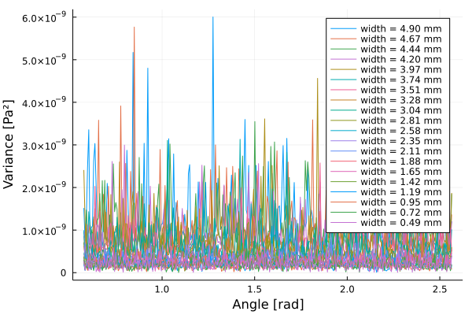
    
     <h5 align="left"> 
    Fig.9 - Stokes pressure variance on each radial line as a function of angular coordinates a long the Stokes domain. On the left we have the flat interface case and on the right the default geometry case. 
    </h5>

figure $(9)$ we do not se any obvious patterns in the distribution for the flat interface case, but for the default geomtry case we see a  qualitatively match between the variance spikes and the frequiency of the interface sinewaves. This hints to the fact that the local interface geomtry affects the local pressure profile. 

In figure $(10)$ we see the absolute normal flow.

    
    <h5 align="left"> 
    Fig.10 - Absolute Stokes normal flow on the interface as a function of CSF-width. For these simulations we used the default geometry. The complete data is available in the folder data_single_inner_negsine/txt_files/us_nflow.txt.
    </h5>

Form figure $(10)$ we observe again a decreasing trend for the normal flow when width decreases. Around the typical width we get a normal flow of roughly $5\cdot10^{-4} \ \text{mm/s}$ which in comparison to a maximum flow velocity around $700 \ \text{mm/s}$ yields a relative deviation 

$$
\frac{\text{Norm. flow}}{\text{max} \ u_S} \approx \frac{5\cdot10^{-4} }{500} \approx \cdot 10^{-4} \ \\%.
$$

Thus we are still getting neglible deviations. By looking at the simulation for a width of $1.45 \ \text{mm}$ we see that the CSF normal flow mainly happens around the edges of each negative sinewave dimple as seen in figure $(11)$. We also take a look at the direction of flow in such a dimple which is shown in figure $(12)$. 

    
    <h5 align="left"> 
    Fig.11 - Direction and magnitude of Stokes normal flow along interface for a simulation at width $1.45 \ \text{mm}$ using the default geometry. The x-axis denote the position along the interface in terms of curve length going from left to right (in flow direction). The left y-axis corresponding to the grey lines show the radial position of the interface (perturbations) and serves as reference for the interface geometry. The right y-axis shows the Stokes CSF normal flow. A positive value means that it flows through the interface from Stokes to Darcy domain and vice versa. 
    </h5>

    
    <h5 align="left"> 
    Fig.12 - A ParaView visualization of the CSF flow in the Stokes domain in a dimple of the default geometry using a width of $1.45 \ \text{mm}$ (same simulation as referred to in figure $(11)$. The magnitude (us Magnitude) of the flow is shown as a heatmap and the direction of the flow field is indicated with white vector arrows (not scaled by magnitude). The arrow population is randomly generated. The brown-ish color in the bottom denote the Darcy domain without any data representations applied. 
    </h5>

 
From figure $(11)$ we obserbe that the CSF flows into the brain tissue mainly during its path from the middle of the sinewave dimple and all the way up to the hard square edge (notice that the flow direction is left to right). We have no information about the velocity field in the brain tissue, but by combinning the information from figure $(11)$ and $(12)$ one might argue that we have two kinds of distint flow patterens: 

1. First, we observe that the CSF is cutting the cornes of the square edges, which is deduced from the fact that the in-flow to the brain tissue increases just before meeting a square edge but then immediately reverses after the edge. 

2. Secondly, by comparing the sizes of the in and out-flow we can deduce qualitatively that some of CSF makes its way all the way though the brain tissue from dimple to dimple. Intuitively we can make sense of this as the phenonema that not all the CSF "have time" to avoid the obstacle (brain tissue with reduced flow properties) and is forced to penetrate it rather than go around. 

### Varying interface wavelength and amplitude

Due to the so far promising result for the default brian geometry we invistigate the consequences of more extreme interface models. That is, we vary the wavelength in the interval [1,  50] mm keeping the default amplitude of 1 mm and vary the ampltidue in the interval [0.1, 5] mm keeping the default wavelength of 10 mm. We keep otherwise specified default geometry parameters. The results of these variations are shown in figure $(13)$.

    
    

    
    
     <h5 align="left"> 
    Fig.13 - Stokes pressure max variance (top row) and absolute Stokes normal flow on the interface (bottom row), both as a function of CSF-width for various interface wavelengths keeping amplitude $A = 1 \ \text{mm}$ (left column) and various interface amplitudes keeping wavelength $\lambda = 10 \ \text{mm}$ (right column). The complete data is available at {data_inner_negsines_λ.../data_inner_negsines_A...)/{ps_radial_var.txt,us_nflow.txt}, where the dot replaces the wavelength and ampltidue values. 
    </h5>

From figure $(13)$ we mainly observe that a more extreme interface modelling, low wavelength (high frequency) and high amplitude, gives raise to a less constant Stokes pressure profile and more normal flow though the interface. However, the only exception is the $\lambda = 1 \ \text{mm}$ case the top left subfigure of figure $(13)$. Here it seems like the small wavelength makes it *difficult* for the CSF to reach the bottom of the dimples, and the interface becomes pseudo flat. By looking at the velocity magnitude in figure $(14)$ we see that flow velocity is rather low in the dimples for the 1 mm wavelength case (left) compared to the that of the 10 mm wavelength in the default geometry (right).

    
    
     <h5 align="left"> 
    Fig.14 - Stokes velocity magnitude (us Magnitude) for simulations of CSF-width $1.45 \ \text{mm}$ with a 1 mm wavelength interface (left) and a 10 mm wavelength interface (right) and otherwise defaul geometry.
    </h5>

Considering the worst case pressure variance from the results shown in figure $(13)$ we still find the deviations to lie at a maximum of 0.3 \%, which is a fairly positive result for the prospects of dimension reduction. 

### Varying permeability 

Finally we invistigate the consequences of varying the permeability $\mu$ governing the percolation flow. We do so by repeating previous evaluations for the default geomtry with permabilities in the range $[10^{-16},10^{-12}] \ \text{m}^2$. The results are shown in figure $(15)$

    
    
     <h5 align="left"> 
    Fig.15 - Stokes pressure max variance (left) and absolute Stokes normal flow on the interface (right), both as a function of CSF-width for various permeability. The complete data is available at...
    </h5>

From figure $(15)$ we observe that the pressure variance is seemingly uneffected by the change in permeability in the four orders test range. Regarding the normal flow we se that it increases as the permeability is reduced. This is in agreement with expectations considering that a lower permeability gives rise to a less resistant percolation flow. However, surprinsgsly enough this did not introduce any significant deviations greater than already seen from the variations on the interface shown in figure $(13)$

### 3D brain simulations

Finally, we extend our studies to the 3D case with the scope of getting some brief insight whether the 2D results carries over to the 3D simulations. As a disclaimer it must be mentioned that we did not really have the opportunity to do a more rigious analyse of the 3D case due to the time limitations of this project. We exteneded the 2D model with an outer arc of 30 mm into the new direction. We choose a resolution of $lc = 2 \ \text{mm}$ mainly due to computational limits given the availble time, and we do test the solution with any manufactured solutions. Thus we have no guarantee for the quality of the following solutions. Due to the nature of the stress free boundary conditions along the new stokes boundaries, we found that the stokes flow seems to be concentrated along the center line (with respect to the third dimension) close to the interface surface. Thus we evaluate the pressure profile along some manually chosen radial lines at the center of the model as shown in figure $(16)$

   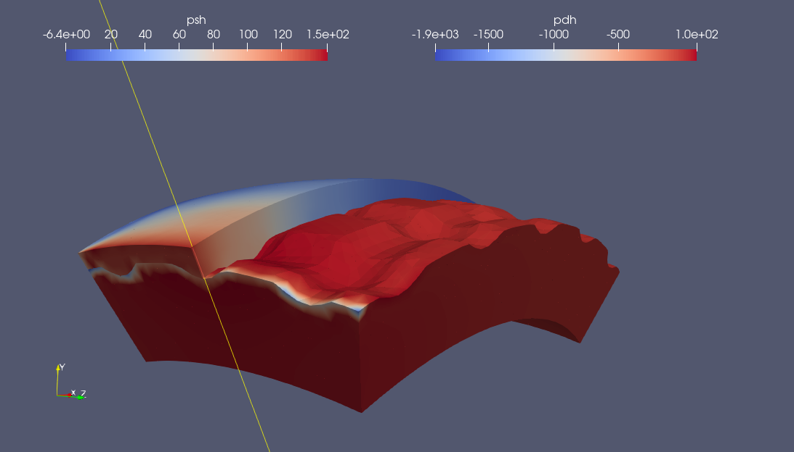
    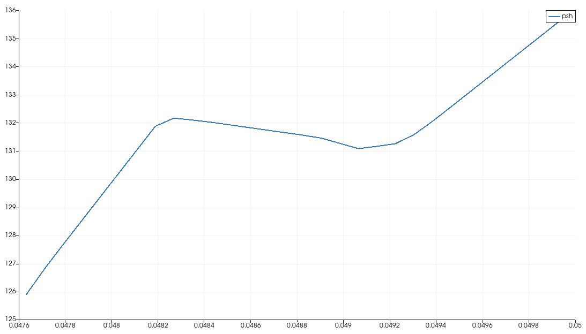
    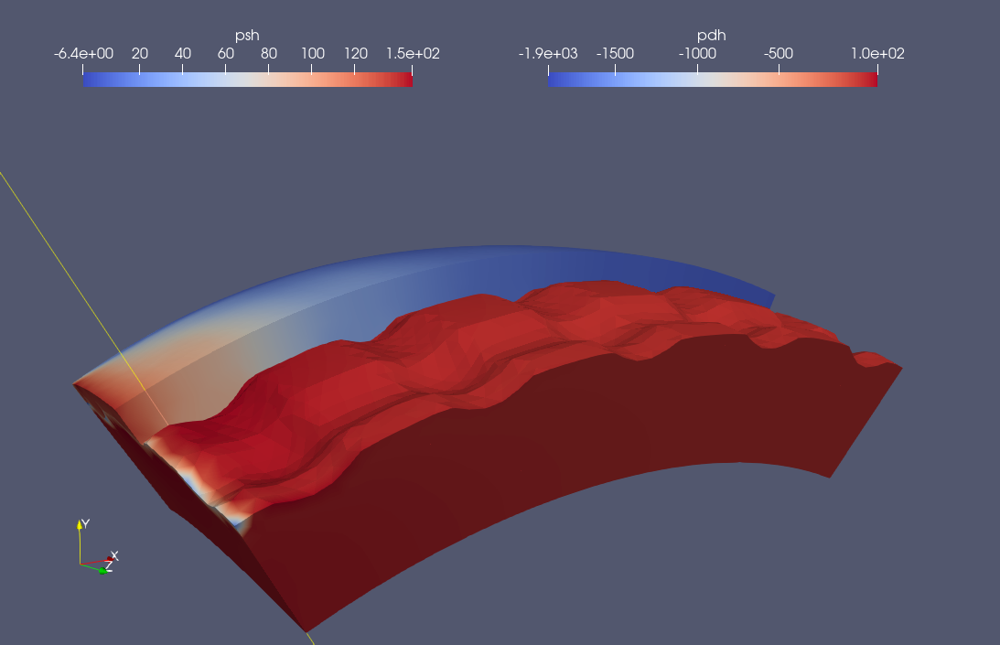
    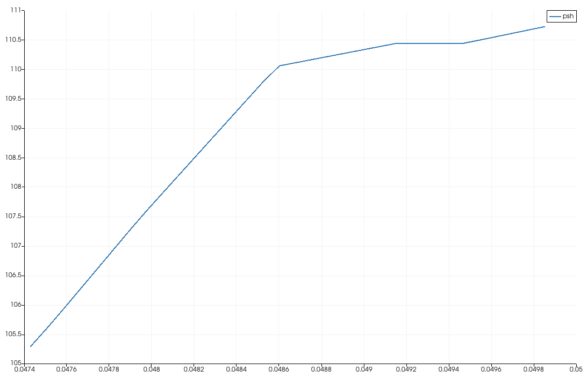
    
    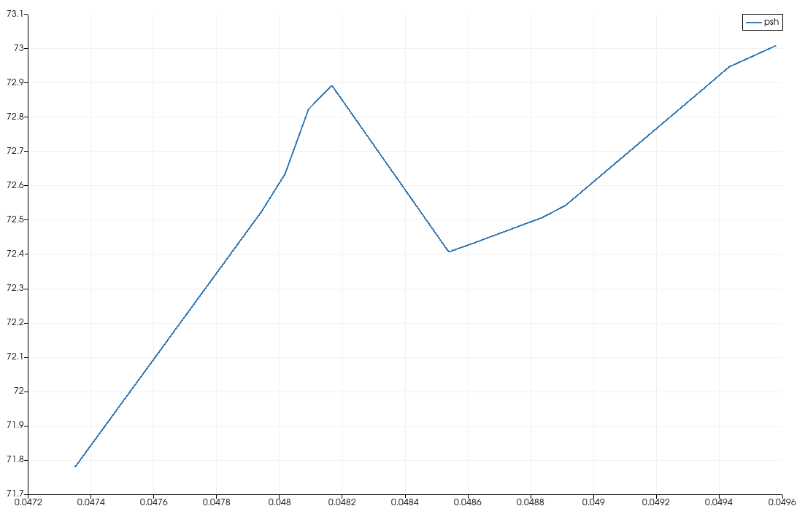
    
    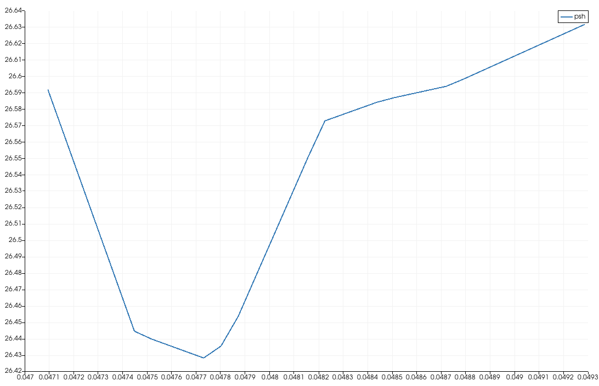
    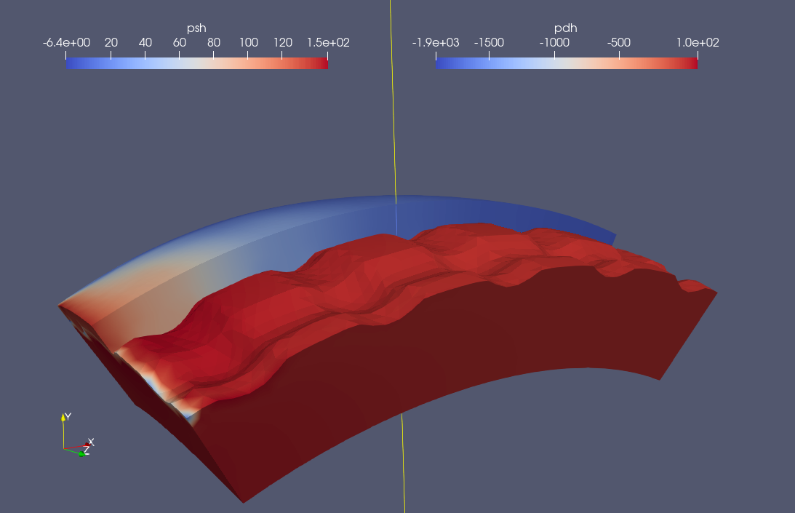
    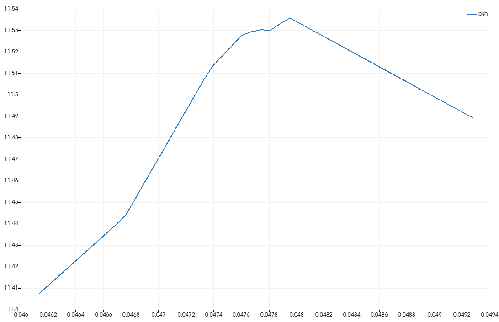
    
    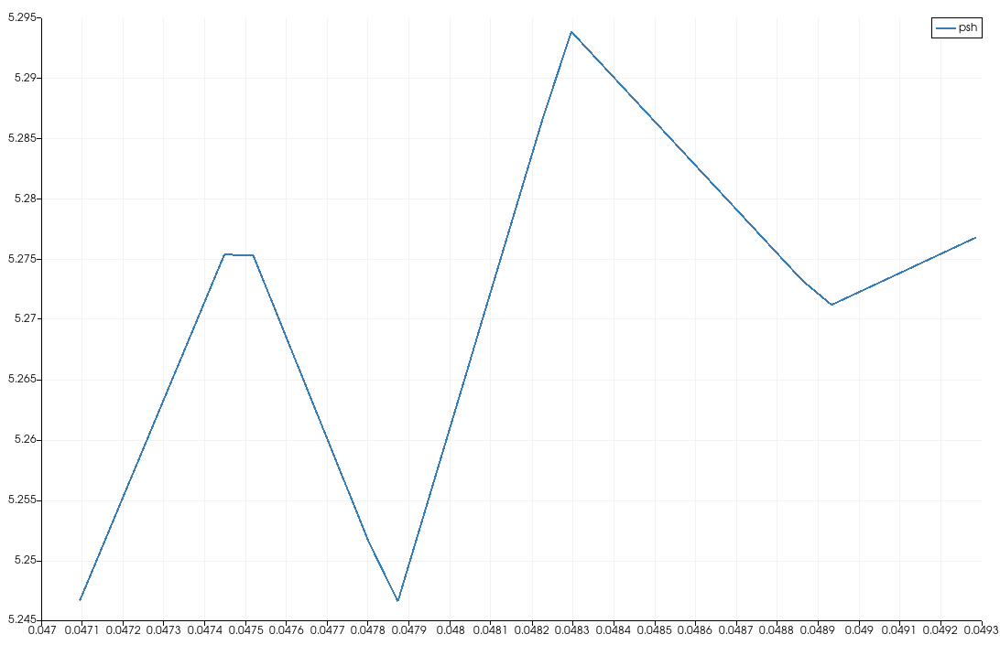
    
    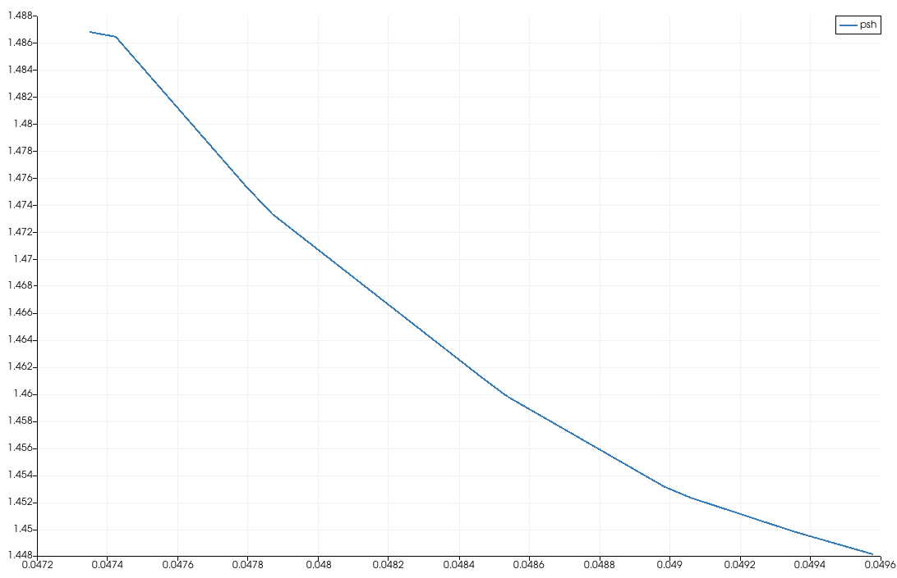
     <h5 align="left"> 
    Fig.16 - 3D model pressure results and display of manually chosen radial line (left) and Stokes pressure profile along the mentioned radial lines (right). For these simulations we used a 3D geomtry with outer arc lengths (100, 30) mm, resolution lc = 2 mm and otherwise following the equliviants of the 2D default default geometry
    </h5>

From figure $(16)$ we see that the relative pressure halfwidth is highest in the first measurement at the left boundary, where we read it off to be roughly 

$$
  \frac{1}{2} \frac{\text{max }(p_S) - \text{min }(p_S)}{\text{max }(p_S)} \approx \frac{1}{2}\frac{136 - 126}{136} \approx 4 \ \\%.
$$

Thus we are starting to get some bigger deviations compared to the 2D case which might be significant for the prospects of dimension reduction model. We also evaluate the normal flow along the interface surface which is shown figure $(17)$.

    
    <h5 align="left"> 
    Fig.17 - 3D model absolute Stokes normal flow on the interface as a function of CSF-width. For these simulations we used a 3D geomtry with outer arc lengths (100, 30) mm, resolution lc = 2 mm and otherwise following the equliviants of the 2D default default geometry. The complete data is available in the folder data_3D/txt_files/us_nflow.txt.
    </h5>

From the results in figure $(17)$ we see a similar trend of decreasing normal flow with width as seen for the 2D model. However, three of the data point stands out from this trend around in the interval around 2-3 mm stokes width. We do not have any good explantions for the time being, since it happens for widths above the tpyical length we choose to ignore it for now. At a width of  $1.45 \ \text{mm}$ the normal flow reads roughly 0.006 mm/s. Since the results showed some quite high velocites on the corners of this model we can not really use the maximum flow velocity as a reference this time. Instead we calculate the absolute flow magnitude along the interface as

$$
    \sqrt{\int (u_S \cdot u_S) \ d\Gamma}
$$

which gives approximately 0.08 mm/s giving a a reletive deviation of 7.5 %. Thus we start to get some higher deviation percentages that could be signs that the 3D case is a bit more challenging regarding the prsopects for dimension reduction than that of the 2D case. 

<!-- 

    
    <h5 align="left"> 
    Fig.X - Caption
    </h5>

 -->
