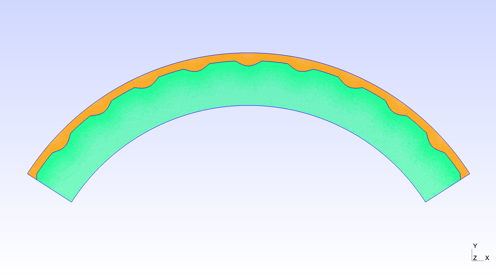
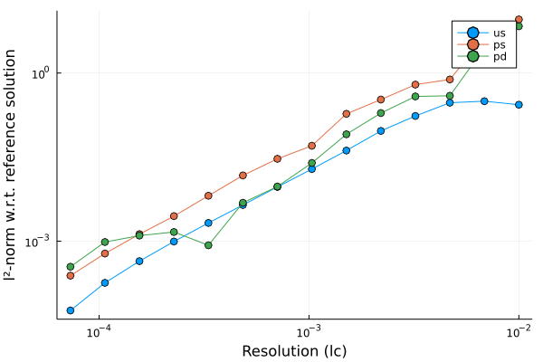

# Simula_SummerProject (find better name)

TODO
- Check that end width is included
- Vary permeability 
- Try 3D (200.000 unknowns)

This repo contains the work done as a summer intern at Simula during a six week period in the summer of 2022. The project was guided by my supervisor [Miroslav Kutcha](https://github.com/MiroK).

## Introduction 

In this project we build a framework for simulating the flow of the cerebrospinal fluid (CSF) in the human brain. The CSF flows, among other regions, on the outside of the brain tissue in the outer most layer of the head. The CSF enter the brain tissue through small pores in the brain tissue and a part in the transpoortation of waste matter produced in the brain. Thus, simulating the CSF flow can be of great benefit for medical research. However, such simulations becomes computational expensive when considering large regions of the brain and hence we want to invistigate the possibility to introduce a simpler model by the use of dimension reduction. That is, instead of considering the CSF-filled space as a 3D sphere shell with thickness in the radial direction we reduce it to a 2D sphere encapsulating the brain tissue. In order for this simplification to be sucessfull we most be able to neglect the dynamics in the reduced dimension without any great impact on the predicted flow. More precisely we want the pressure to be approximately constant on the crosssection to the fluid flow in the radial plane. In addition we want negligble velocity normal to the main CSF flow. Due to the fact that the CSF-filled space is much longer than it is thick one can hypothesize that the flow will meet the above criteria rather well. 

We are going to simulate the CSF flow using the finite element method to solve the partial derivative equations. For simplicity we take on a 2D problem where we consider a 2D slice of the brain, and consider the dimension reduction in the radial direction such that the CSF-filled space is reduced to a line. By decreasing the width of the CSF-filled space we can study the decolopment of the pressure profile on the crossection and the normal flow on the interface between the CSF-filled space and the brain tissue. For a more realistic approach we introduce wiggled surfaces and study the prospects for dimension reduction for different brain geomtries.

<!-- Maybe show 2D and 3D models here -->

We are going to use Julia as the programming language for this project. We use the [Gridap](https://gridap.github.io/Gridap.jl/stable/) module for the finite element part and [Gmsh](https://gmsh.info) for creating the geometry and the mesh.

## Method & Theory 

### Domain

We are going to model our brain as a composition of two domains: The *Stokes* domain and the *Darcy* domain corresponding to the equations that governs the fluid flow in these domains. Se figure (...) for reference. In the *Stokes* domain the fluid flows in a unobstructed path on the outside of the brain tissue, where the motion is described as Stokes flow (low Reynolds number). In the *Darcy* domain the fluid flows though the pores of the brain tissue where the fluid motion is described as percolation. For this we use Darcy's law.

The default geometry parameters for our 2D brain slice is a shown in table (...). The resulting geometry is visualized in figure (...).

|  Parameter | Default value | Testing interval 
|---|:---:|:---:|
| Radius of curvature | 50 mm |
| Radial length of slab | 10 mm |
| Outer arc length | 100 mm |
| Interface wiggles | Negative half sine wave|
| Outer surface wiggles | No wiggling |
| Wavelength of interface wiggles | 10 mm | [1,  50] mm|
| Amplitude of interface wiggles | 1 mm | [0.1, 5] mm |

<figure align="center">
    
    <figcaption align="center">An elephant at sunset</figcaption>
</figure>

    

<!-- 

<figure align = "center">

<figcaption align = "center"><b>
Fig.X - Example of default 2D brain geometry. 
</b></figcaption>
</figure align = "center">
  -->

<!-- 

  

### Equations 

We denote $u_S, p_S$ as velocity and pressure respectively in the Stokes domain $S$, and $p_D$ as pressure in the Darcy domain $D$. We define the problem by the following equations.

#### Stokes domain

$$
\begin{align}
    - \nabla \cdot \sigma(u_S, p_S) &= f_s  &\text{in} \ \Omega_S \\
    \nabla \cdot u_S &= 0   &\text{in} \ \Omega_S \\
    u_S &= u_{S,0}   &\text{on} \ \Lambda_S \\
    u_S \times \hat{n}_S &= 0   &\text{on} \ \Gamma_S \\
    p_S &= p_{S,0}   &\text{on} \ \Gamma_S \\
\end{align}
$$

where

$$
\begin{align}
   \sigma(u_S, p_S) &= 2\mu \varepsilon(u_S) - p_S \mathbb{I} \\
   \varepsilon(u_S) &= \frac{1}{2}(\nabla u_S + \nabla^Tu_S)
\end{align}
$$

#### Darcy domain

$$
\begin{align}
    \nabla \cdot (-\frac{\kappa}{\mu}\nabla p_D) &= f_D  &\text{in} \ \Omega_D \\
     P_D &= P_{D,0}  &\text{on} \ \partial \Omega_S \setminus \Gamma 
\end{align}
$$

#### Interface conditions
$$
\begin{align}
    u_S\cdot\hat{n}_S + (-\frac{\kappa}{\mu}\nabla p_D \cdot \hat{n}_D) &= g\Gamma  &\text{on} \ \Gamma \\ 
    -[\sigma(u_S, p_S)\cdot\hat{n}_S]\cdot\hat{n}_S &= P_D  &\text{on} \ \Gamma \\
    -[\sigma(u_S, p_S)\cdot\hat{n}_S]\cdot\hat{\tau}_S &= \alpha u_S \cdot\hat{\tau}_S  &\text{on} \ \Gamma \\
\end{align}
$$

### Weak formulation

We define the test spaces $v_S, q_S, q_D$ to be in the Sobolev space (H1). Check consistency with $dx$ or $dV, dS, dL$.

#### Stokes
From equation (...) we get

$$
\begin{align}
    \int_{\Omega_S} f_s \cdot v_S \ dx &=  \int_{\Omega_S} 2\mu \ \varepsilon(u_S) \odot \varepsilon(v_S) \ dx - \int_{\Omega_S} p_S \nabla\cdot v_S \ dx - \int_{\partial\Omega_S} \big(\sigma(u_S, p_S)\cdot\hat{n}_S\big) \cdot v_S \ dx \\ 
    0 &= - \int_{\Omega_S} (\nabla \cdot u_S) \cdot q_S
\end{align}
$$

In the first equation (put number) Decompose the last term in normal $\hat{n}_S$ and tangential $\hat{\tau}_S$ direction

$$
\begin{align}
    - \int_{\partial\Omega_S} \big(\sigma(u_S, p_S)\cdot\hat{n}_S\big) \cdot v_S \ dS   &=  \int_{\partial\Omega_S} \underbrace{-\Big[\big(\sigma(u_S, p_S)\cdot\hat{n}_S\big) \cdot \hat{n}_S \Big]\Big[\hat{n}_S \cdot v_S \Big]}_{P_D \ \text{on} \ \ \Gamma} -\underbrace{\Big[\big(\sigma(u_S, p_S)\cdot\hat{n}_S\big) \cdot \hat{\tau}_S \Big]\Big[\hat{\tau}_S \cdot v_S \Big]}_{\alpha u_S \cdot\hat{\tau}_S \ \ \text{on} \ \Gamma} \\
    &= \int_{\partial\Omega_S\setminus\Gamma} -\Big[\underbrace{\big(\sigma(u_S, p_S)\cdot\hat{n}_S\big) \cdot \hat{n}_S }_{- p_S} \Big]\Big[\hat{n}_S \cdot v_S \Big] -\Big[\big(\sigma(u_S, p_S)\cdot\hat{n}_S\big) \cdot \hat{\tau}_S \Big]\Big[\hat{\tau}_S \cdot v_S \Big]  +  \int_{\Gamma} P_D - \alpha u_S \cdot\hat{\tau}_S \ dL
\end{align}
$$

where we used the transistion

$$
\begin{align}
    \big(\sigma(u_S, p_S)\cdot\hat{n}_S\big) \cdot \hat{n}_S &= \big(2\mu \ \varepsilon(u_S) - p_S \mathbb{I} \big)\cdot\hat{n}_S \\
    &= 2\mu \ \underbrace{\hat{n}_S \cdot \varepsilon(u_S) \cdot \hat{n}_S}_{0} - p_S \ \underbrace{\hat{n}_S \cdot \hat{n}_S}_{1} = - p_S
\end{align}
$$

with the zero in line (...) comes from theorem something in that paper (REFER).

We can then handle the remaining tangential component of the  $\partial\Omega_S\setminus\Gamma$ boundary using the Nitsche method (theorem?).  

$$
\begin{align}
    - \int_{\partial\Omega_S\setminus\Gamma} \Big[\big(\sigma(u_S, p_S)\cdot\hat{n}_S\big) \cdot \hat{\tau}_S \Big]\Big[\hat{\tau}_S \cdot v_S \Big] = 
    &- \int_{\partial\Omega_S\setminus\Gamma}\Big[\big(\sigma(u_S, p_S)\cdot\hat{n}_S\big) \cdot \hat{\tau}_S \Big]\Big[\hat{\tau}_S \cdot v_S \Big] \\
    &- \int_{\partial\Omega_S\setminus\Gamma}\Big[\big(\sigma(u_S, p_S)\cdot\hat{n}_S\big) \cdot \hat{\tau}_S \Big]\Big[\hat{\tau}_S \cdot u_S - u_{S,\text{tan}} \Big] \\
    &+ \int_{\partial\Omega_S\setminus\Gamma}\frac{\gamma}{h} \Big[ \hat{\tau}_S \cdot u_S - u_{S,\text{tan}} \Big]\Big[\hat{\tau}_S \cdot u_S \Big]
\end{align}
$$

where $u_{S,\text{tan}}$ is the condition for the tangential part of the stokes velocity on the $\partial\Omega_S\setminus\Gamma$. We only want the normal component and thus we set $u_{S,\text{tan}}$ = 0

#### Darcy 

$$
\begin{align}
    \int_{\Omega_D} f_D \cdot q_d \ d\vec{x} &= \int_{\Omega_D} \frac{\kappa}{\mu} \nabla p_D \cdot \nabla q_D \ dx + \int_{\partial\Omega_D} \underbrace{-\hat{n}_D \cdot \frac{\kappa}{\mu} \nabla p_D}_{g\Gamma - u_S \cdot \hat{n}_S \ \text{on} \ \Gamma} \cdot q_D \ dx \\
    &=\int_{\Omega_D} \frac{\kappa}{\mu} \nabla p_D \cdot \nabla q_D \ dx + \int_{\Gamma} (g\Gamma - u_S \cdot \hat{n}_S) \cdot q_D - \int_{\partial\Omega\setminus\Gamma} \hat{n}_D \cdot \kappa \nabla p_D \cdot q_D
\end{align}
$$

where we handle the last term as neuman condition.

## Modelling the brain

We are going to use 
$$
\begin{align}
    u_{S,0} &= 0 \\
\end{align}
$$

$\nabla \cdot x$ is the same as $Div(x)$.

## Results and Discussion

<!-- 

  

 -->

