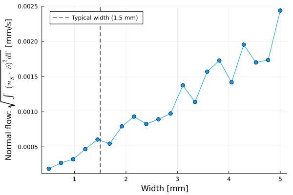
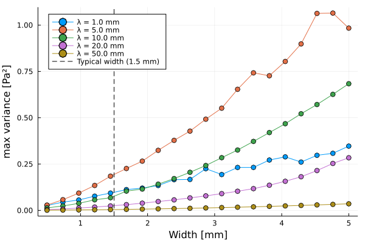

# Simula Summer Project - Prospects of dimension reduction for cerebrospinal fluid flow in brain simulations

TODO
- Clarify direction of low (left to right)
- Talk about that things is tested with manufactured solutions 
- Explain structure of repo 
- Comment code
- Put comma and dots on equations (where it looks fine on the readme as well)

This repo contains the work done as a summer intern at Simula during a six week period in the summer of 2022. The project was guided by my supervisor [Miroslav Kutcha](https://github.com/MiroK).

## Introduction 

In this project we build a framework for simulating the flow of the cerebrospinal fluid (CSF) in the human brain. The CSF flows, among other regions, on the outside of the brain tissue in the outer most inside the skull. The CSF enter the brain tissue through small pores in the brain tissue and takes part in the transpoortation of waste matter produced in the brain. Thus the motivation for simulating the CSF flow is to contribute to medical brain research. However, such simulations becomes computational expensive when considering large regions of the brain and hence we want to invistigate the possibility to introduce a simpler model by the use of dimension reduction. That is, instead of considering the CSF-filled space as a 3D sphere shell with thickness we reduce it to a 2D sphere encapsulating the brain tissue. In order for such a simplification to be sucessful we most be able to neglect the dynamics in the reduced dimension without any great impacts on the predicted flow. More precisely we want the pressure to be approximately constant on the cross section of the CSF flow through the radial plane. In addition we should have negligble flow in the normal direction to the main CSF flow. Due to the fact that the CSF-filled space is much longer than it is thick, one can hypothesise that the flow might meet the above criterias rather well. 

We are going to simulate the CSF flow using finite elements to solve the partial derivative equations. For simplicity we initially take on a 2D problem where we consider a 2D slice of the brain. Thus the corresponding dimension reduction problem is to reduce the 2D slice surface of the CSF-filled space to a 1D line. By decreasing the width of the CSF-filled space, we can study the devolopment of the pressure profile on the cross section of the CSF flow and the normal flow on the interface between the CSF-filled space and the brain tissue, as the surface approaches a line. In figure $(1)$ we see the visualization of a real brain scannings as reference for the system we are going to model.

    
    
     <h5 align="center"> 
    Fig.1 - Real brain scanning as a reference for the model geometry. The blue color indicates the CSF-filled space, the white-brown-ish color the brain tissue and the red parts some of the major blood vessels. The left image shows a full 3D view of the brain tissue surface, while the right image shows a sliced version of it.
    </h5>

As seen in figure $(1)$ the surface of the brain is not smooth. Thus we will introduce a wiggled surface and study the prospects for dimension reduction for different geometric modelling of the surface.

Progamming wise we are going to use Julia as the main language for this project. We use the [Gridap](https://gridap.github.io/Gridap.jl/stable/) module for the finite element part and [Gmsh](https://gmsh.info) for creating the geometry and the mesh.

## Method & Theory 

### Domain

We are going to model our brain as a composition of two domains: The *Stokes* domain and the *Darcy* domain with names corresponding to the equations that governs the fluid flow in these domains (See figure $(2)$ for reference). In the *Stokes* domain the CSF flows in an unobstructed path on the outside of the brain tissue, where the motion is described as Stokes flow (low Reynolds number). This is the domain that we have described as the CSF-filled region so far. In the *Darcy* domain the fluid flows though the pores of the brain tissue where the fluid motion is described as percolation. For this we use Darcy's law. The dividing line between these domains is what we will refer to as the *interface*.

    
    <h5 align="center"> 
    Fig.2 - Example of 2D brain model using default geometry. The orange region represents the Stokes domain $\Omega_S$ and the green region the Darcy domain $\Omega_D$. The black line dividing the stokes and the darcy domain represent the interface $\Gamma$. In addition we have grouped and named the boundaries for later reference. For the stokes domain we have the outer surface $\Lambda_S$ and the left and right boundaries $\Gamma_S$. For the Darcy domain all boundaries expect the interface is grouped as $\Gamma_D$. 
    </h5>

We are going to define a set of default brain geometry parameters for our 2D brain model. The parameters is shown in the following table where we have also included the parameter test interval for the interface geometry. Notice that we used the default geometry to showcase the 2D domains in figure $(2)$.

|  Parameter | Default value | Testing interval 
|---|:---:|:---:|
| Radius of curvature | 50 mm |
| Radial length of slab | 10 mm |
| Outer arc length | 100 mm |
| Width of CSF-filled space | 1.5 mm |
| Interface wiggles | Negative half sine waves|
| Outer surface wiggles | No wiggling |
| Wavelength of interface wiggles | 10 mm | [1,  50] mm|
| Amplitude of interface wiggles | 1 mm | [0.1, 5] mm |

Eventually we also want to extend the study to 3D simulations where we will use the same default values as a starting point.

### Equations 

We denote $u_S, p_S$ as velocity and pressure respectively in the Stokes domain $S$, and $p_D$ as pressure in the Darcy domain $D$. $\hat{n}_i$ and $\hat{\tau}_i$ denote the normal and tangentiel component on the $\Gamma$ interface with respect to region $i$. We define the problem by the following equations.

####  <ins> Stokes domain </ins>

$$
\begin{align}
    - \nabla \cdot \sigma(u_S, p_S) &= f_s  &\text{in} \ \Omega_S  \\
    \nabla \cdot u_S &= 0   &\text{in} \ \Omega_S \\
    u_S &= u_{S,0}   &\text{on} \ \Lambda_S \\
    u_S \times \hat{n}\_S &= 0   &\text{on} \ \Gamma_S \\
    p_S &= p\_{S,0}   &\text{on} \ \Gamma_S
\end{align}
$$

where

$$
\begin{align}
   \sigma(u_S, p_S) &= 2\mu \ \varepsilon(u_S) - p_S \mathbb{I} \\
   \varepsilon(u_S) &= \frac{1}{2}(\nabla u_S + \nabla^Tu_S)
\end{align}
$$

#### <ins> Darcy domain </ins>

$$
\begin{align}
    \nabla \cdot (-\frac{\kappa}{\mu}\nabla p_D) &= f_D  &\text{in} \ \Omega_D \\
     P_D &= P_{D,0}  &\text{on} \ \Gamma_D
\end{align}
$$

#### <ins> Interface conditions </ins>
$$
\begin{align}
    u_S\cdot\hat{n}_S + (-\frac{\kappa}{\mu}\nabla p_D \cdot \hat{n}_D) &= g\Gamma  &\text{on} \ \Gamma \\ 
    -[\sigma(u_S, p_S)\cdot\hat{n}_S]\cdot\hat{n}_S &= P_D  &\text{on} \ \Gamma \\
    -[\sigma(u_S, p_S)\cdot\hat{n}_S]\cdot\hat{\tau}_S &= \alpha u_S \cdot\hat{\tau}_S  &\text{on} \ \Gamma
\end{align}
$$

### Weak formulation

We define the test spaces $v_S, q_S, q_D$ to be in the Sobolev space (H1). 

#### Stokes
From eq. $(1)$ we get

$$
\begin{align}
    \int_{\Omega_S} f_s \cdot v_S \ dx &=  \int_{\Omega_S} 2\mu \ \varepsilon(u_S) \odot \varepsilon(v_S) \ dx - \int_{\Omega_S} p_S \nabla\cdot v_S \ dx - \int_{\partial\Omega_S} \big(\sigma(u_S, p_S)\cdot\hat{n}_S\big) \cdot v_S \ dx \\ 
    0 &= - \int\_{\Omega_S} (\nabla \cdot u_S) \cdot q_S \ dx.
\end{align}
$$

In eq. $(13)$ we decompose the last term in normal $\hat{n}_S$ and tangential $\hat{\tau}_S$ direction as

$$
\begin{align}
    - \int_{\partial\Omega_S} \big(\sigma(u_S, p_S)\cdot\hat{n}_S\big) \cdot v_S \ dx   &=  \int\_{\partial\Omega_S} \underbrace{-\Big[\big(\sigma(u_S, p_S)\cdot\hat{n}_S\big) \cdot \hat{n}_S \Big]}\_{P_D \ \text{on} \ \ \Gamma}\Big[\hat{n}_S \cdot v_S \Big] \underbrace{-\Big[\big(\sigma(u_S, p_S)\cdot\hat{n}_S\big) \cdot \hat{\tau}_S \Big]}\_{\alpha u_S \cdot\hat{\tau}_S \ \ \text{on} \ \Gamma}\Big[\hat{\tau}_S \cdot v_S \Big] \ dx\\
    &= \int\_{\partial\Omega_S\setminus\Gamma} -\Big[\underbrace{\big(\sigma(u_S, p_S)\cdot\hat{n}_S\big) \cdot \hat{n}_S }\_{- p_S} \Big]\Big[\hat{n}_S \cdot v_S \Big] -\Big[\big(\sigma(u_S, p_S)\cdot\hat{n}_S\big) \cdot \hat{\tau}_S \Big]\Big[\hat{\tau}_S \cdot v_S \Big] \ dx\\
    & \qquad \qquad \qquad \qquad \qquad \qquad \qquad + \int\_{\Gamma} P_D \Big[\hat{n}_S \cdot v_S \Big] + \alpha \Big[u_S \cdot\hat{\tau}_S \Big]\Big[\hat{\tau}_S \cdot v_S \Big] \ dx,
\end{align}
$$

where we used the transistion

$$
\begin{align}
    \big(\sigma(u_S, p_S)\cdot\hat{n}_S\big) \cdot \hat{n}_S &= \big(2\mu \ \varepsilon(u_S) - p_S \mathbb{I} \big)\cdot\hat{n}_S \\
    &= 2\mu \ \underbrace{\hat{n}_S \cdot \varepsilon(u_S) \cdot \hat{n}_S}\_{0} - p_S \ \underbrace{\hat{n}_S \cdot \hat{n}_S}\_{1} = - p_S.
\end{align}
$$

We zero out the first term in line (...) using the theorem in the paper (REFER). We handle the remaining tangential component of the  $\partial\Omega_S\setminus\Gamma$ boundary using the Nitsche method (theorem?)

$$
\begin{align}
    - \int_{\partial\Omega_S\setminus\Gamma} \Big[\big(\sigma(u_S, p_S)\cdot\hat{n}_S\big) \cdot \hat{\tau}_S \Big]\Big[\hat{\tau}_S \cdot v_S \Big] \ dx= 
    &- \int\_{\partial\Omega_S\setminus\Gamma}\Big[\big(\sigma(u_S, p_S)\cdot\hat{n}_S\big) \cdot \hat{\tau}_S \Big]\Big[\hat{\tau}_S \cdot v_S \Big] \ dx\\
    &- \int\_{\partial\Omega_S\setminus\Gamma}\Big[\big(\sigma(u_S, p_S)\cdot\hat{n}_S\big) \cdot \hat{\tau}_S \Big]\Big[\hat{\tau}\_S \cdot u_S - u\_{S,\text{tan}} \Big] \ dx\\
    &+ \int\_{\partial\Omega_S\setminus\Gamma}\frac{\gamma}{h} \Big[ \hat{\tau}\_S \cdot u_S - u\_{S,\text{tan}} \Big]\Big[\hat{\tau}_S \cdot u_S \Big] \ dx
\end{align}
$$

where $u_{S,\text{tan}}$ is the condition for the tangential part of the stokes velocity on the $\partial\Omega_S\setminus\Gamma$. We only want the normal component and thus we set $u_{S,\text{tan}}$ = 0.

#### Darcy 

$$
\begin{align}
    \int_{\Omega_D} f_D \cdot q_d \ dx &= \int_{\Omega_D} \frac{\kappa}{\mu} \nabla p_D \cdot \nabla q_D \ dx + \int_{\partial\Omega_D} \underbrace{-\hat{n}_D \cdot \frac{\kappa}{\mu} \nabla p_D}\_{g\Gamma - u_S \cdot \hat{n}_S \ \text{on} \ \Gamma} \cdot q_D \ dx \\
    &= \int\_{\Omega_D} \frac{\kappa}{\mu} \nabla p_D \cdot \nabla q_D \ dx + \int\_{\Gamma} (g\Gamma - u_S \cdot \hat{n}_S) \cdot q_D \ dx - \int\_{\Gamma_D} \hat{n}_D \cdot \kappa \nabla p_D \cdot q_D \ dx
\end{align}
$$

where we handle the last term as a neuman condition.

### Parameter choices for the PDE modelling

We are going to drive the CSF flow by a pressure difference $\Delta p_S  = 133.3224 \ \text{Pa}$ $(1 \ \text{mmHg})$, across the stokes domain. For the outer surface of the stokes domain $\Lambda_S$ we enforce a no slip condition as dirichlet condition setting $u_{S,0} = \vec{0} \ \text{m/s}$. This also means that we will put the source terms $f_S = f_D = 0$ in both domains. For the pressure in the Darcy domain we are going to enforce the boundary conditions on all non interface surfaces $\Gamma_D$ as neumann conditions by setting a zero flux, i.e. $\nabla p_D = \vec{0} \ \text{Pa/m}$. For the interface $\Gamma$ we choose a balanced normal flow, i.e. $g\Gamma = 0 \ \text{m/s}$ and a slip rate given as $\alpha = \mu/\sqrt{\kappa} \ \text{Pa}\cdot\text{s/m}$. Finally we set the CSF viscosity $\mu = 0.8 \cdot 10^{-3} \ \text{Pa}\cdot\text{s}$ and the percolation permeability $\kappa = 1\cdot10^{-16}$ \ \text{m}^2. These parameter choices is summed up in the following  

$$
\begin{align}
    u_{S,0} &= \vec{0} \ \text{m/s} \\
    p_{S,0} &= 133.3224 \ \text{Pa} \ (1 \ \text{mmHg} ) \\
    \nabla p_D &= \vec{0} \ \text{Pa/m} \\
    g\Gamma &= 0 \ \text{m/s} \\
    \alpha &= \mu/\sqrt{\kappa} \ \text{Pa}\cdot\text{s/m} \\
    \mu &= 0.8 \cdot 10^{-3} \ \text{Pa}\cdot\text{s} \\
    \kappa &= 1\cdot10^{-16} \ \text{m}^2
\end{align}
$$

This result in the final system of equations

$$
\begin{align}
    a_{v_S} &= \int_{\Omega_S} 2\mu \ \varepsilon(u_S) \odot \varepsilon(v_S) \ dx + \int\_{\Gamma} \alpha \big[u_S \cdot\hat{\tau}\_S \big]\big[\hat{\tau}\_S \cdot v_S \big] \ dx - \int\_{\Omega_S} p_S \nabla\cdot v_S \ dx + \int\_{\Gamma} P_D \big[\hat{n}\_S \cdot v_S \big] \ dx \\
    a_{q_S} &= - \int\_{\Omega_S} (\nabla \cdot u_S) \cdot q_S \ dx \\
    a_{q_D} &= -\int\_{\Gamma} ( u_S \cdot \hat{n}_S) \cdot q_D \ dx + \int\_{\Omega_D} \frac{\kappa}{\mu} \nabla p_D \cdot \nabla q_D \ dx \\
    a_N &= \int\_{\Gamma_S}- \Big[\big(\sigma(u_S, p_S)\cdot\hat{n}_S\big) \cdot \hat{\tau}_S \Big]\Big[\hat{\tau}_S \cdot v_S \Big] \ dx - \Big[\big(\sigma(u_S, p_S)\cdot\hat{n}_S\big) \cdot \hat{\tau}_S \Big]\Big[\hat{\tau}_S \cdot u_S \Big] \ dx
    + \frac{\gamma}{h} \Big[ \hat{\tau}\_S \cdot u_S  \Big]\Big[\hat{\tau}_S \cdot u_S \Big] \ dx
\end{align}
$$

$$
\begin{align}
    a_{v_S} + a_{q_S} + a_{q_D} + a_N = 0.
\end{align}
$$

<!-- 
|  |  $u_S$ | $p_S$ | $p_D$ |  |
|---|:---:|:---:|:---:|:---:|
| $(v_s)$ |  $\int_{\Omega_S} 2\mu \ \varepsilon(u_S) \odot \varepsilon(v_S) \ dx$   $+ \int\_{\Gamma} \alpha \big[u_S \cdot\hat{\tau}_S \big]\big[\hat{\tau}_S \cdot v_S \big] \ dx$ |  $- \int_{\Omega_S} p_S \nabla\cdot v_S \ dx$ |  $\int\_{\Gamma} P_D \big[\hat{n}_S \cdot v_S \big] \ dx$ |  $=0$ |
| $(q_s)$ |  $- \int\_{\Omega_S} (\nabla \cdot u_S) \cdot q_S \ dx$ |  |  | $= 0$ |
| $(q_D)$| $-\int\_{\Gamma} ( u_S \cdot \hat{n}_S) \cdot q_D \ dx$ | - |  $\int\_{\Omega_D} \frac{\kappa}{\mu} \nabla p_D \cdot \nabla q_D \ dx$ |  $=  0$ |
 -->

### Evaluating the metrics for dimension reduction 

In order to evaluate whether the stokes pressure is approximately constant on the cross section, we create a collection of radial lines in the stokes domain as shown in figure $(3)$. By using these as integration paths we create the variance associated to each radial line $RL$ as  

$$
\text{var}(p_S)_{RL} = \int_{RL} \Big(p_S(x) - \big\langle p_S(x) \big\rangle\Big)^2 dx \ / \int_{RL} 1 \ dx.
$$

If the pressure is going towards a constant profile the variance will go towards zero. We compute both the mean and the maximum value of all variances along the radial lines. In addition we compute the value of the mean absolute normal flow along the interface as 

$$
\sqrt{\int_{\Gamma} \Big((u_S(x)) \cdot \hat{n}\_S(x)\Big)^2 dx} \ / \ \int\_{\Gamma} 1 \ dx.
$$

Finally we create two center lines, one for each domain, which we use as an integration path for comparing the quality of the solutions (see figure $(3)$). This further explained in the section [Choosing the resolution](#Choosing-the-resolution)

    
    <h5 align="center"> 
    Fig.3 - 100 radial lines in this example. Default run case also 
    </h5>

## Results and Discussion

We begin by assessing the 2D case.

### Choosing the resolution

For the choice of the mesh resolution we perform an approximated error convergence test by simulating a series of systems with an increasing resolution. In Gmsh the mesh size resolution is parameterized by the *lc* variable, which in our case is set to define the largest mesh line tetrahedral mesh. In addition we define a so-called mesh field which linearly decrease the lc-value to half its orginal value over a distance of 1 to 5 mm from the interface, such that the mesh is twice as small around the interface. By choosing an exaggerated resolution of $lc = 0.05 \ \text{mm}$ as our approximated *true* reference solution* we can calculate the $l^2$-norm between this reference solution and other solutions with lower resolution. This is shown in figure (...)

    
    <h5 align="center"> 
    Fig.X - Approximated error convergence test using a resolution of $lc = 0.05 \ \text{mm}$ as a true reference solution. We calculate the $l^2$-norm between the reference solution and solutions using a lower resolution (higher $lc$) along a center line for both the domains. This is performed using the default 2D brain geometry.
    </h5>

From figure (...) we get an appropximated view of which accuracy to expect from a given resolution. By choosing $lc = 0.1 \ \text{mm}$ we should get an accuracy on the order $\pm 0.1 \\%$ of the true solution. To meet limitations on availble computer power we settle on $lc = 0.1 \ \text{mm}$ in the following 2D simulations. 

### Flat interface

We begin by the simple case of the default brain geometry, but with a flat interface. That is, we model the interface as a curve arc without any wiggles. We simulate the system with a varying CSF-width (witdh of the stokes domain cross section) in the interval [0.5, 5] mm. the result are shown in figure (...) and (...). 

    
    
     <h5 align="center"> 
    Fig.X - Caption
    </h5>

We observe that the pressure variance decreases along with the width. Considering that the pressure difference across the domain is $ \Delta P_S = 133.3224 \ \text{Pa}$ the relative pressure deviation from the mean on a radial line in the worst case scenario (using the maximum variance) with a width close to the typical width of 1.5 is roughly on the order
 
$$
\frac{\text{max std}}{\Delta p_S} = \frac{\sqrt{\text{max var}}}{\Delta p_S} = \frac{\sqrt{10^{-9}}}{133.3224} \approx \cdot 10^{-5} \ \\%,
$$

which is considered neglible. We can confirm that the pressure is approximately constant by looking at the pressure profile across a radial line.

    
    
     <h5 align="center"> 
    Fig.X - width = 1.45 mm
    </h5>

In addition we evaluate the absolute normal flow on the interface.

    
    <h5 align="center"> 
    Fig.X - Caption
    </h5>

We see that the absolute normal flow drops seemingly linearly with width. When comparing the magnitude of the normal flow,  at a width of 1.45 mm, to the maximum velocity of $700 \ \text{mm/s}$ we get a relative deviation on the order 

$$
\frac{\text{Norm. flow}}{\text{max} \ u_S} = \frac{10^{-5}}{700} \approx 1,4 \cdot 10^{-6} \ \\%,
$$

Thus the flat interface shows promosing properties for dimension reduction. 

### Default interface (Interface with wiggles)

We now introduce the wiggles back to the interface and compute similar metrics as done for the flat curve. The pressure variance is shown in figures (---) and (---)

    
    
     <h5 align="center"> 
    Fig.X - Caption
    </h5>

We observe again that the pressure variance decreases with decreasing width, but the order of magnitude is significantly larger than for the flat interface. At the width close to the typical width of 1.5 mm the relative pressure deviation from the mean on a radial line in the worst case scenario (using the maximum variance) with a width close to the typical width of 1.5 mm is roughlt on the order

$$
\frac{\text{max std}}{\Delta p_S} = \frac{\sqrt{\text{max var}}}{\Delta p_S} = \frac{\sqrt{10^{-1}}}{133.3224} \approx  0.1 \ \\%,
$$

This is still to be considered an acceptable margin of error. 

Until now we have seen that there is a small difference in the mean variance and then maximum variance. In the case of the default geometry we see that the maximum variance is roughly twice as large as the mean variance. By looking at the the variance for each radial line as a function of angle we can make a visual check to see if someting interesting is going on.

    
    <h5 align="center"> 
    Fig.X - Caption
    </h5>

By looking at figure (...) we see qualitatively that the variance spikes following the frequiency of the interface sinewaves. In figure (...) we see the absolute normal flow.

    
    <h5 align="center"> 
    Fig.X - Caption
    </h5>

Form figure (...) we again see an decreasing trend for the normal flow when width decreases. Around the typical width we get a normal flow aorund $5\cdot10^{-4} \ \text{mm/s}$ compared which compared to a maximum flow velocity around $700 \ \text{mm/s}$ a relative deviation 

$$
\frac{\text{Norm. flow}}{\text{max} \ u_S} = \frac{5\cdot10^{-4} }{500} \approx 8,3 \cdot 10^{-5} \ \\%,
$$

Thus we are still getting promising results for the possibility to make dimension reduction model. By looking at the simulation for a width of $1.45 \ \text{mm}$ we see that the CSF normal flows mainly happens around the edges of each negative sinewave dimple (figure (...)). We also take a look at the direction of flow in such a dimple (see figure (...)) 

    
    <h5 align="center"> 
    Fig.X - Caption
    </h5>

    
    <h5 align="center"> 
    Fig.X -  (not scaled magnitude).
    </h5>

We can see that the CSF flows into the the brain tissue during its path from the middle of the sinewave dimple and all the way up to the hard square edge. Unfortunately we have no information about the velocity field in the brain tissue, but by combinning the information from figure (---) and (---) one might argue that we have two kinds of flows: First we observe that CSF is cutting the cornes of square edges, meaning that the in-flow to the brain tissue increases just before meeting a square edge but then immediately reverses after the edge. However, bu comparing the sizes of the in and out-flow we can conclude that some of CSF that flows inte the brain tissue from the bottom of the dimple and forward makes it all the way through to the beginning of the next dimple. This makes sense as not all the CSF have time to avoid the obstacle and is forced to penetrate it rather than go around. 

### Varying interface wavelength and amplitude

Due to the promising result for the default brian geometry we invistigate the consequences of more extreme interface models. That is, we vary the wavelength in the interval [1,  50] mm with default amplitude of 1 mm and vary the ampltidue in the interval [0.1, 5] mm keeping the default wavelength of 10 mm. The results are shown in figure (...) and (.).

    
    

    
    
     <h5 align="center"> 
    Fig.X - Multi caption
    </h5>

We see mainly that a more extreme surface, low wavelength (high frequency) and high amplitude, gives raise to a less constant stokes pressure profile and more normal flow though the interface. However, the only exception is the $\lambda = 1 \ \text{mm}$ simulation in figure (...). It seems that the small wavelength makes it *difficult* for the CSF to reach the bottom of the dimples, and the surface becomes pseudo flat. By looking at the velocity magnitude in figure (...) we see that there is not much flow in dimples in the 1 mm wavelength simulation compared to that of the default 10 mm wavelength.

Considering the worst case scenario of the above simulations we hit a maximum deviation (pressure) around 0.3 \%.

    
    
     <h5 align="center"> 
    Fig.X - 10 mm left (default) and 1 mm right
    </h5>

### Varying permeability 

Finally we try to invistigate the consequences of lower permeability. 
Test interval: $[10^{-16},10^{-12}] \ \text{m}^2$.

Due to the increased easy of flow in the brain tissue this should make things worse. 

    
    
     <h5 align="center"> 
    Fig.X - 
    </h5>

### 3D brain simulations

stress free config and projection vector for tangential parts. 

or periodic boundry conditions from back to front. 

    
    <h5 align="center"> 
    Fig.X - Caption
    </h5>

<!-- 

    
    <h5 align="center"> 
    Fig.X - Caption
    </h5>

 -->
